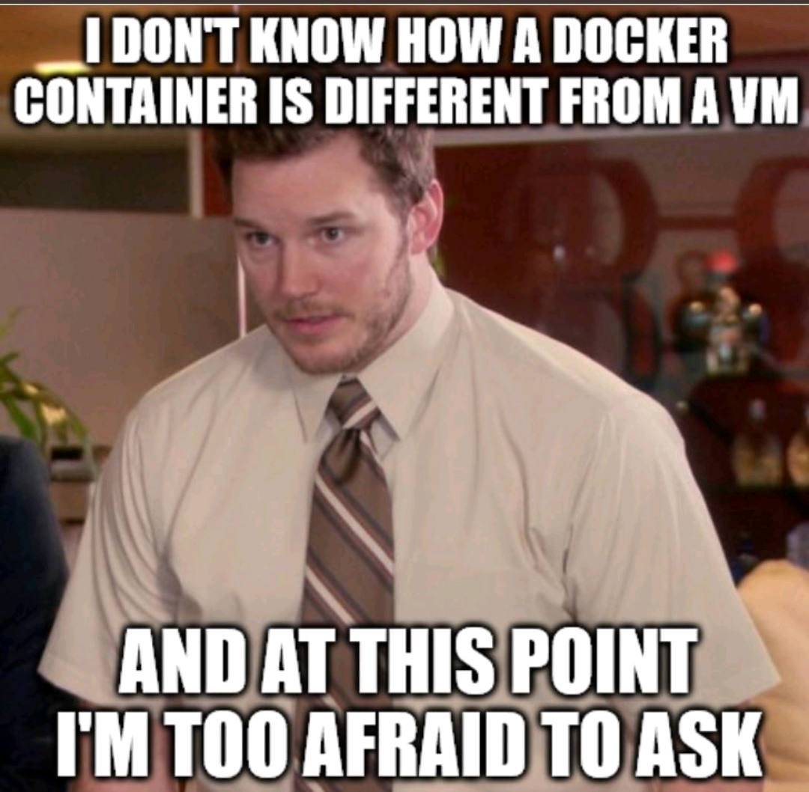

# My Learning Journey

Welcome!, this is a personal space where I share my learning progress and thoughts about things. If for some reason you find this repo, I hope you find it useful. :smile:

To make things neater and more organized for myself, I will be making it in sync with my dev blog on [dev.to](https://dev.to/). Can be found [here](https://dev.to/irakan) for better categorization and easier navigation.

## Why am I doing this? :thinking:
They say that writing things down helps you remember things better. I'm doing this to help me remember what I've learned and to reflect on my progress. It will organize my thoughts and help me see the bigger picture. I also hope that this will help me become a better writer.

> - "I write to discover what I know." - Flannery O'Connor


## Current Skill Levels as of 1st January 2024 (01/01/2024) :calendar: ( this list is not exhaustive, but it highlights the main skills I have ) :computer:

| Skill                                        | Level                  |
|----------------------------------------------|------------------------|
| PHP (Laravel) ❤️                                | █████████░ (9/10)    |
| PHPUNIT Testing                              | █████████░ (9/10)    |
| JavaScript (Vue.js)                          | ████████░░ (8/10)    |
| Laravel Inertia.js                           | ████████░░ (8/10)    |
| CSS (Tailwind CSS)                           | ██████░░░░ (6/10)  *(Note: Not a designer, but can make things look good)* |
| SQL (MySQL)                                  | ████████░░ (8/10)    |
| NoSQL (MongoDB)                              | ███████░░░ (7/10)  |
| Git                                          | ████████░░ (8/10)    |
| Linux (Ubuntu) + Bash Scripting              | ███████░░░ (7/10)    |
| Docker                                       | ███████░░░ (7/10)    |
| WSL2 (Windows Subsystem for Linux) ❤️           | ███████░░░ (7/10)    |
| VSCode (Visual Studio Code)  ❤️                 | ████████░░ (8/10)    |
| REST API                                     | █████████░ (9/10)    |
| OOP (Object Oriented Programming)            | █████████░ (9/10)    |
| Github Actions (CI/CD)                       | ███████░░░ (7/10)    |
| S3 (Amazon Simple Storage Service)           | ███████░░░ (7/10)    |
| Mermaid (Diagramming and Charting Tool) + Chatgpt :exploding_head: | █████████░ (9/10) |
| Started learning Python for the past 2 months (Still a beginner) | ████░░░░░░ (4/10) |
Apache KFKA | ████░░░░░░ (4/10) |


## Monthly Progress :chart_with_upwards_trend: ( I will update throughout each month, whenever I learn something new )
## Fomat will be as follows:
### Month/Year (MM/YYYY)
- **Day/Month/Year (DD/MM/YYYY)** 

    Topics: (List of topics that I will write about)
    - Learned about this
    - Learned about that
    - Learned about this other thing

    **Resources:**
    - [Link to resource 1](https://www.google.com)
    - [Link to resource 2](https://www.google.com)

----------------------------------------------------------
### 01/2024
- **01/01/2024**

    Topics: (Laravel)
    - It turns out that in (Laravel Eloquent) there is an `increment` and `decrement` methods built in that you can use to increment or decrement a column value by a given amount.<br><br>For example, if you have a `balance` column in your `users` table, you can do something like this: `$user->increment('balance', 100);` to add 100 to the user's balance. You can also do `$user->decrement('balance', 100);` to subtract 100 from the user's balance.<br><br> But make sure that you are not using SIGNED INT for the column, otherwise you will have negative values. You can use UNSIGNED INT instead.

    **Resources:**
    - [Laravel Eloquent increment()](https://laravel.com/docs/10.x/queries#increment-and-decrement)

- **02/01/2024**

    Topics: (Twitter/X)
    - I like Twitter/X, its my favorite social media platform. I like to use it follow people I am interested in and inspire me. <br><br>Twitter/X has a `For You` tab which is an alothorithmically generated feed of tweets that it thinks you will like. I like this feature because it helps me discover new people and things that I am interested in.<br><br> But, recently I have noticed Its been showing me things that I am not interested in whatsoever. When you go to `https://twitter.com/settings/your_twitter_data/twitter_interests` you can see what are the topcis Twitter/X thinks you are interested in. <br><br>So, I counted them using javascript in the console and I have `377` topics apparently. And belive me when I see that 80% of them are not things I am interested in (Example: Mark Zuckerberg, Vladimir Putin, Pumpkin recipes :jack_o_lantern:, etc). So, I deleted them by executing javascript in the browser's console that will uncheck all the checkboxes. Hope this helps me get better recommendations. :smile: <br><br>
    ***NOTE: when trying to copy a code snippet and paste it in browser's (Chrome) console, you will need to allow pasting in the console by writing `allow pasting` in the console and pressing enter. Then you can paste the code snippet and press enter to execute it.***

    **Resources:**
    - [Bulk Uncheck Twitter/X Interests](https://peshmerge.io/how-to-check-uncheck-all-checkboxes-on-a-web-page-using-vanilla-javascript/)

- **03/01/2024**

    Topics: (Meetings)
    - Today while driving, I was listening to a podcast between David Heinemeier Hansson and Jason Fried (Basecamp founders). They were talking about how toxic meetings are for various reasons:
        - 1 hour meeting with 5 people is not a 1 hour meeting, its a 5 hour meeting. Because you are taking 1 hour of each person's time. So, you need to be very careful when you call a meeting.
        - They involve coordination, causing scheduling issues and disrupting everyone's workflow and mindset
        - They are usually not productive, because people are rarely prepared for them.
        - They drift off topic and go on tangents that are not relevant to the meeting.

        After I finished listing to the podcast, I wanted to check if there are facts that support this. I found this reserch on [Harvard Business Review](https://hbr.org/2017/07/stop-the-meeting-madness) According to their survey of 182 senior managers across industries:
        - 65% said meetings hindered their personal work completion.
        - 71% found meetings unproductive and inefficient.
        - 64% felt meetings compromised deep thinking.
        - 62% believed meetings missed opportunities to bring the team closer.

        So, here is what some companies (Example: Basecamp and 37signals) do to avoid traditional meetings:
        - They go to first-writing approach instead of a first-meeeting approach. If there's something to discuss, write it down first, share it with the team, and then have a meeting only if and only if it's absolutely necessary.
        - They use automatic weekly check-ins, like "What did you do this week?" through platforms like Slack. This keeps everyone informed and enables the creation of weekly reports for the team and stakeholders.
        - There are also occasional automated "social questions" to encourage team members to share non-work-related activities, fostering better relationships.

        As a result, the stakeholders are happy because they are getting weekly reports and the team is happy because they are not wasting their time in meetings. :smile:

        **Resources:**
        - [Stop the Meeting Madness](https://hbr.org/2022/03/dear-manager-youre-holding-too-many-meetings)
        - [Meetings are Toxic (Season 2)](https://37signals.com/podcast/meetings-are-toxic-season-2/)
        - [How We Communicate](https://37signals.com/how-we-communicate/)

- **04/01/2024**
  
    Topics: (Mentalhealth, Motivation)
    - Today I came across multiple posts talking about "Toxic Positivity", and the first question that came to my mind is "How can positivity be toxic!?" 😅. Here is the explanation of what does "Toxic Positivity" means:

        > Toxic positivity is the belief that one should always maintain a positive mindset, no matter the circumstances. It discourages acknowledging or expressing negative emotions.
        
        I did some research about this and actually, the words in (Toxic positivity) are oxymoron, which means logically there is no such thing as "Toxic positivity". It's like saying "Square Circle" or "Married Bachelor" which doesn't make any sense.
        
        So, for now, let's call it "Fake positivity" or "Empty positivity". Which I truly believe it exists, where people throw around phrases like:
        - Good vibes only. ✌️😁
        - Stop being so negative, Think happy thoughts only. 🛑😃
        - Just be positive. 😊
        - Stay positive, everything will be fine.😃
        
        to someone going through a tough time or feeling stuck. These words feel empty and It's like a quick-fix without really understanding the depth of what the person is going through.
        
        I came across this example that will clarify things better:
        
        > Would you tell a crying baby to just cheer up and think positive?
        > No. You would realize the baby is crying because they are cold, hungry, wet, or want to be held. You would fix what was wrong instead of trying to silence them.
        
        It's good to have emotions and feel them.. just don't stay there forever. And If you surround yourself with an environment that solely emphasizes positive vibes, it can be harmful because it promotes an unrealistic approach to life.
        
        > We should grieve, be angry, feel rejected when appropriate. However, the key is not to stay in the emotion.
        
        **Resources:**
        - [Toxic Positivity](https://www.lipstickalley.com/threads/toxic-positivity.2017256/)
        - [Prerna Rohilla’s Post](https://www.linkedin.com/posts/contentonweb-prerna-rohilla_hello-fam-i-am-back-with-thursday-think-activity-7082630849363423232-7c8m)
        - [Toxic Positivity? Seriously?](https://www.youtube.com/watch?v=PW0q2jWouxQ)

- **06/01/2024**
  
    Topics: (kubernetes)
    - I recently found myself lacking knowledge about Kubernetes. I have read some posts about it, and I know it's like a management tool. It's somewhat similar to Composer and NPM for managing packages, but Kubernetes is for managing Docker containers. I didn't dive into it in the past because it was not relevant to me, and to be completely honest, I was running away from it (maybe scared). Now it's time to face it. 😬

        As they say, knowing the name of the enemy is the first step towards winning! Today, I want to shed light on its name. Kubernetes!? For some reason, I didn't like it. It's a long word, and I always find myself struggling to pronounce it. 🤔
        
        After researching, I found that Craig McLuckie, one of the founders of the Google-based Kubernetes project, said:
        
        > We had 13 other names we couldn’t get past Google’s legal department. It was the last day, and I had to pick something. I was driving into work, and I thought, ‘Well, [the technology] is like driving a container ship. What would the helmsman be called?’ So I tried to find something exotic. I had no idea what the Greek for that was. I had to look it up.
        
        Basically, the word "κυβερνήτης" ([Check How to pronounce κυβερνήτης](https://en.bab.la/pronunciation/greek/%CE%BA%CF%85%CE%B2%CE%B5%CF%81%CE%BD%CE%AE%CF%84%CE%B7%CF%82)) is a Greek term that translates to "helmsman" or "steersman" in English.
        
        To make sure, I opened Google Translator and typed "helmsman" then translated it into Greek, which gave me "πηδαλιούχος" pronounced as "pidalioúchos." That's incorrect; it's not even close to Kubernetes's word sound. I dug deeper and found the Liddell & Scott Greek-to-English lexicon, published in 1909, which had these meanings: "steersman, helmsman, guide, governor" for "κυβερνήτης." on page 397, which I was looking for. 
        
        Now, what does "helmsman" mean?
        
        > A helmsman or helm (sometimes driver or steersman) is a person who steers a ship, sailboat, submarine, or any other type of maritime vessel or spacecraft. 
        
        Another question: Why do people mention it sometimes as K8s?
        
        "K8s" is shorthand for Kubernetes because there are 8 letters between "K" and "s" in the word "Kubernetes" making it shorter and easier to type without spelling mistakes. 
        
        Now that I know the origin of "Kubernetes" I can sleep in peace. 😴
        
        **Resources:**
        - [How did they ever come up with that kooky ‘Kubernetes’ name? Here’s the inside story
        ](https://www.geekwire.com/2016/ever-come-kooky-kubernetes-name-heptio/)
        - [Liddell & Scott Greek-to-English lexicon, page:397](https://archive.org/details/dli.ernet.510177/page/397)
        - [Helmsman Definition](https://en.wikipedia.org/wiki/Helmsman).

- **08/01/2024**
  
    Topics: (Hypervisor)
    - What is a hypervisor? A hypervisor is a software that creates and runs virtual machines (VMs). It allows you to run multiple operating systems on a single physical machine and share the underlying hardware resources. It will allocate the resources (CPU, RAM, Storage, etc) to each VM. <br><br>

        There are two types:

        - Type 1: Bare Metal Hypervisor (Native Hypervisor)
           -  What? It directly communicates with hardware, making it efficient and secure without a middleman OS.It can allocate more resources to virtual machines than your server actually has. For instance, with 128GB of RAM and eight VMs, you can assign 24GB to each, totaling 192GB. However, VMs use only the necessary RAM for their tasks, not the full allocated amount.
            -  Who? Used by enterprises and data centers (e.g., Amazon, Google) for running multiple OS on one machine.
            -  When to Use: Large data centers or server farms for maximum performance and direct hardware access.
            - Example: VMware ESXi, Microsoft Hyper-V.


        - Type 2: Hosted Hypervisor
            - What? Operates within the regular OS, less powerful but user-friendly.
            Type 1 hypervisors allocate resources dynamically based on VM needs, making it easier. Type 2 hypervisors use fixed allocations, so if a user assigns 8GB to a VM, it takes that amount even if not fully used. This can lead to resource issues on the host machine.
            - Who? Used by developers and individuals for running multiple OS on one machine.
            - When to Use: Simple setups or software development when top performance is not critical.
            - Example: VMware Workstation, Oracle VM VirtualBox.

        Here is a diagram that explains it better than words. :smile: <br><br>
        


        **Resources:**
        - [What is a hypervisor?](https://aws.amazon.com/what-is/hypervisor/)
        - [Hypervisor Diagram](https://en.wikipedia.org/wiki/Hypervisor#/media/File:Hyperviseur.svg)

- **09/01/2024**
  
    Topics: (Docker)
    - Have you ever wondered how Docker containers work? <br><br>
    <br><br>

        First, lets make these things clear:

        - VMs have their own kernel, making them heavier and slower compared to Docker containers.
        - Docker containers share the host machine's kernel, making them lightweight and faster than VMs.
        - There are different ways to create containers, but Docker is the most popular one (example: Podman, LXC, LXD, etc).
        - A container must follow the OCI (Open Container Initiative) standards to be considered a container.

        Now, lets see how (Docker Linux containers) works. <br><br>

        They are normal Linux processes that run in an isolated environment. And they rely on the following Linux features:
        - Namespaces: This keeps each container separate from the others. It isolates things like processes, network, user IDs, and file systems, but they still share the same basic system (kernel).
        - Control groups (cgroups): These control and limit how much of the computer's resources (like CPU, memory, disk, and network) each container can use. It helps in managing and isolating resource usage for a group of processes.

        So, now what happens when you execute a command like `docker run -it ubuntu bash`? <br><br>
        - Docker will create a new container process.
        - a new namespace will be created for the container.
        - a new cgroup will be created for the container.
        - a new root filesystem will be created for the container.
        - a new network interface will be created for the container.

    **Resources:**
    - [What Is a Standard Container](https://iximiuz.com/en/posts/oci-containers/)

- **09/01/2024**
  
    Topics: (Data Lake, Data Warehouse, Data Mart)

    - Well, data is everywhere every second of every day.As a backend developer, I used to  dodge terms related to data engineering. However, due to a recent project, I've started learning more about it.
    <br><br>
        
    <br><br>
        So, I came across these terms: Data Lake, Data Warehouse, and Data Mart. I will break them down into simple terms that I can understand. 
        
        The format will be as follows:
        - Definition: (Definition)
        - Characteristics: (Characteristics)
        - Why it exists: (Why it exists)
        - Tools: (Tools that can be used to implement it)
<br><br><br>

    1. **Data Lake:**
        - **Definition:** A huge storage space for all raw data (For example: JSON, Videos, Database dumps, etc) where everything is dumped without organization.
        - **Characteristics**:
            - Stores raw data without modification.
            - Store structured, semi-structured, and unstructured data.
            - Can be Used for the entire data lifecycle.
        - **Why it exists:** Data is valuable nowdays and it can be used for many things. So, store it and you can use it later when you need it.
        - **Tools:** 
            - *Free:* Hadoop Distributed File System (HDFS)
            - *Paid:* Amazon S3, Azure Data Lake Storage, Google Cloud Storage
<br><br><br>
    2. **Data Warehouse:**
        - **Definition:** An organized storage place where data is structured and cleaned.
        - **Characteristics**:
            - Stores data in a structured way.
            - Requires transformed and cleaned data.
            - Time-variant data, meaning any existing data will be archived after perid of time (Example: 1 year) and stored in the Data Lake.
        - **Why it exists:** Since data is stored in a structured way, it can be used for reporting and analysis.
        - **Tools:** 
            - *Free:* PostgreSQL, MySQL, MariaDB (limitions: not scalable for HUGE data and not optimized for analytics purposes)
            - *Paid:* Amazon Redshift, Google BigQuery
<br><br><br>
    3. **Data Mart:**
        - **Definition:** A subset of a Data Warehouse, with a focus on specific topics.
        - **Characteristics**:
            - Users don't need advanced technical knowledge.
            - Subset of a Data Warehouse, smaller and topic-focused.
            - Users have read-only access to specific information.
        - **Why it exists:** Provides users a quick and easy access to data for specific topics.
        - **Tools:** 
            - *Free:* Microsoft Power BI (limited features)
            - *Paid:* Microsoft Power BI, Tableau, QlikView, Looker

    **Resources:**
    - [Data Lake vs Data Warehouse vs Data Mart](https://www.sprinkledata.com/blogs/data-lake-vs-data-warehouse-vs-data-mart)

- **11/01/2024**
  
    Topics: (Motivation, MentalHealth)
    - These are some thoughts I have learned/read somewhere that I would like to always make them stick in my mind and I want to write them down here so I can always come back to them and remind myself of them. <br><br>

        - ITS NOT YOU!. No matter your job or how high up you are, it's not because you're smarter, better, stronger, or hard worker than others. It's not about your connections. It's because God gave you this, and you should be always grateful for it. Don't let it get to your head, and be always humble.
<br><br>
        - YOU ONLY HAVE CONTROL OVER YOUR ACTIONS!. You can't control your life, your thoughts, your feelings, other people, or anything else. You have 0 control over everything except your actions. Focus on what you can control.
<br><br>

        - EVERY ONE IS REPLACEABLE!. No matter how good you are at what you do. Here is the bitter truth: You are replaceable and everyone is.
<br><br>

            And always remmber, things can be seen from different perspectives/angles. :smile:
            
            <br><br>


- **14/01/2024**
  
    Topics: (Redis)
    - Ok, So I have been using Redis for a long time in many applications, for storing cache, sessions, and queues. And a question came up that I need to an answer for: Can we scale Redis? and if yes, how? <br><br>

        So, I did some research and here is what I found: <br><br>
        - Redis is in-memory data structure store, which means it stores data in RAM.
        - The amount of data that can be stored in Redis is limited by the amount of RAM available. The more RAM you have, the more data you can store.
        - When Redis uses all the available RAM, it supports swapping to disk. It can help to store more data and avoid crashing, but it will cause a huge performance drop.
        - Based on a real-world test done by Redis team. Redis can handle up to 2^32 keys (4294967296 keys). And Each key can hold a value with its own limits based on the chosen data structure. For example, a string can hold up to 512MB, a list can hold up to 2^32 elements. So, if you store 1 string in each key, you can store up to 4294967296 * 512MB = 2048000000000 MB which is roughly 2 TB of data. That's a lot of data (if you have that much RAM that is :smile:).
        - To estimate the storage capacity of Redis, you can use this formula: `Redis Storage Capacity = Total Available RAM − (Redis Metadata Overhead + OS RAM Usage)` where `Total Available RAM` is the total RAM available in the server, `Redis Metadata Overhead` Redis uses some amount of RAM for its internal metadata to manage keys, values, and other data structures efficiently. `OS RAM Usage` is the amount of RAM used by the operating system and other processes running on the server.

        So, how can we scale Redis? <br><br>
        - Add more RAM to the server. :smile:
        - Its all about the RAM. The more RAM you have, the more data you can store. Its the bottleneck of Redis.
        - When your redis server reach 2^32 keys, you can use Redis Cluster to scale it horizontally by adding more nodes to the cluster. And the load balancer will distribute the requests between the nodes.
        - If your app is using Redis for sessions, you can use sticky sessions(in the load balancer) to make sure that all the subsequent requests from the same user will be routed to the same Redis node where the user's session is stored, otherwise the user will be logged out because the session is not found when the request is routed to a different Redis node by the load balancer.

        **Resources:**
        - [How Much Data Can Redis Store?](https://www.dragonflydb.io/faq/how-much-data-can-redis-store)
        - [Redis FAQ](https://redis.io/docs/get-started/faq/)

- **17/01/2024**
  
    Topics: (NestJS, TypeScript)
    In upcoming days I will shift my focus to learning NestJS and TypeScript for various reasons.
    - Javascript is a very popular language used by many small, big and huge companies (everywhere).
    - Has a huge community and a lot of resources.
    - Can be used for many things (Frontend, Backend, Mobile, Desktop, etc).
    - In performance wise, its very fast and efficient language (very good for high traffic applications, example: Twitter/X).
    - Its a must have skill/tool for any developer that wants to find a work in the tech industry.

    So, I have enrolled in a course on Udemy to learn TypeScript and NestJS. I am on the first section of the course and here what I have learned so far:

    Why does TypeScript exist? <br><br>
    - Typescript is basically a superset of Javascript. It adds types to Javascript. It's like a layer on top of Javsacript. Typescript = Javascript + Type System.
    - Helps you catch errors before you run your code.
    - Helps you write better/Maintainable code.
    - Doesnt run in the browser or nodejs. It needs to be compiled to Javascript first.
    - It doesnt provide any performance benefits.
    - Its like a friend sitting next to you and telling you "Hey, you made a mistake here, you should fix it before you run your code".

    What is a type? <br><br>
    A type is something that describes the different properties and functions that a value has. Lets take exmple of a string:
    ```javascript
    let color = 'red';
    ```
    The type of `color` is `string`. It has properties like `length` and functions like `toUpperCase()`. <br><br>
    Another example: 
    ```javascript
    let count = 5;
    ```
    The type of `count` is `number`. It has properties like `toFixed()` and functions like `toString()`. <br><br>

    And there are 2 categories of types:
    - Primitive Types: (number, string, boolean, symbol, void, undefined, null)
        - They directly store/hode the value.
        - If you have variable a storing number 5, its like saying you have a variable in your hand.
    - Object Types: (functions, arrays, classes, objects).
        - They store a reference to the value.
        - They don't hold the actual data but point to where the data is stored.
        - If you have a variable a storing an an object called Person, its like saying you have a piece of paper in your hand that has the address where the details about that Person are stored, not the Person itself.

    **Resources:**
    - [Typescript Course](https://stackoverflow.com/questions/8790809/whats-the-difference-between-primitive-and-reference-types)